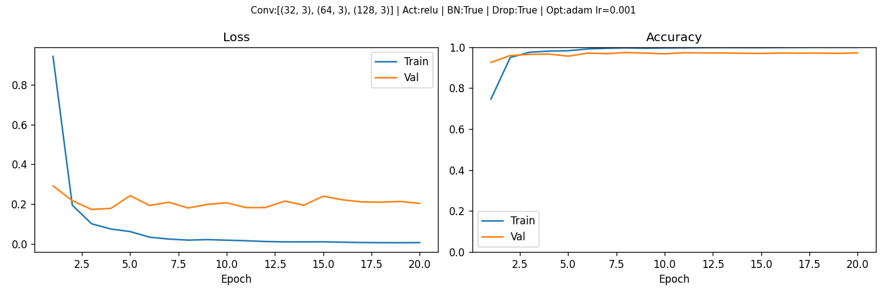
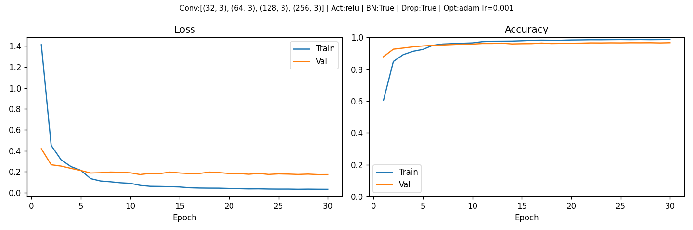

# Documentation — CNN Expérimental Fruits-360

## Vue d'ensemble

`cnn_experiment.py` est un CNN construit **from scratch** (sans transfer learning) appliqué au dataset Fruits-360.
Contrairement à `train_classifier.py` qui réutilise ResNet50 pré-entraîné sur ImageNet, ici le réseau apprend tout depuis zéro — c'est ce qui rend les expérimentations intéressantes : on voit directement l'effet de chaque choix d'architecture.

Le script est inspiré des notebooks du cours Bonneton :
- **CNN-MNIST** : architecture minimale Conv→Pool→Flatten→Dense, sans régularisation
- **CNN-CAT-DOG** : architecture plus profonde avec BatchNorm et Dropout à chaque bloc

---

## Évolution des expériences

### Étape 1 — 5 classes, 10 epochs

**Configuration**
```
CLASSES     : Apple Red 1, Banana 1, Orange 1, Strawberry 1, Kiwi 1
CONV_LAYERS : [(32,3), (64,3), (128,3)]
FC_HIDDEN   : 256
N_EPOCHS    : 10
```

**Résultats**
```
Train : 2419 imgs | Test : 810 imgs
Paramètres : ~1 275 000

Epoch 01/10  loss 0.5192/0.0746  acc 85.99%/97.55%
Epoch 02/10  loss 0.1165/0.0129  acc 97.13%/100.00%
Epoch 10/10  loss 0.0080/0.0006  acc 99.85%/100.00%

Accuracy finale : 100%
```

**Analyse**

100% dès l'epoch 2. Trop facile : 5 fruits très distincts (banane allongée, fraise rouge, kiwi brun...) sur fond blanc uni. Le modèle n'a pas besoin de généraliser, il mémorise les patterns évidents. Aucune valeur pour évaluer l'architecture.

---

### Étape 2 — 10 classes, 10 epochs

**Ce qui a changé**
```
CLASSES : +Grape Blue 1, Mango 1, Pear 1, Pineapple 1, Lemon 1
```

**Pourquoi**

Ajouter des fruits plus similaires : Lemon et Pear ont des formes proches, Orange et Lemon sont de la même couleur. On cherche à créer de vraies confusions inter-classes.

**Résultats**

100% à nouveau. Le dataset Fruits-360 reste trop propre (fond blanc, cadrage parfait) pour qu'un CNN même simple ait du mal sur seulement 10 classes bien différenciées.

---

### Étape 3 — 50 classes, 20 epochs

**Ce qui a changé**
```
CLASSES   : 50 classes variées (fruits, légumes, noix...)
FC_HIDDEN : 256 → 512
N_EPOCHS  : 10 → 20
```
Courbes : `cnn_experiment_curves1.png`


**Pourquoi augmenter FC_HIDDEN**

Avec 50 classes, la couche Dense doit distinguer beaucoup plus de combinaisons de features. 256 neurones compressent trop brutalement les 4608 features issues du Flatten vers 50 sorties. 512 laisse plus de marge de manœuvre pour apprendre des représentations intermédiaires fines.

**Pourquoi 20 epochs**

Avec plus de classes et plus d'ambiguïté (Cherry vs Cherry Sour, Clementine vs Orange vs Grapefruit), la loss met plus longtemps à descendre. Le scheduler coupe le LR par 2 tous les 5 epochs — à 10 epochs on n'aurait pas laissé assez de temps pour affiner les frontières de décision.

**Lecture des courbes (50 classes)**

La val loss se stabilise autour de 0.20 dès l'epoch 5 et ne descend plus, tandis que la train loss continue vers 0. C'est le signe d'un **léger overfitting** : le modèle mémorise les 50 classes d'entraînement mais peine à généraliser sur des images légèrement différentes. La val accuracy plafonne autour de 97%.

---

### Étape 4 — 199 classes, 30 epochs (configuration finale)

**Ce qui a changé**
```
CLASSES     : 199 classes (sélection sur les 255 disponibles)
CONV_LAYERS : [(32,3), (64,3), (128,3)] → [(32,3), (64,3), (128,3), (256,3)]
FC_HIDDEN   : 512 → 1024
N_EPOCHS    : 20 → 30
```
Courbes : `cnn_experiment_curves.png`


**Pourquoi un 4ème bloc convolutif**

Avec 199 classes il faut discriminer des variantes très proches : Cherry 1 vs Cherry 2 vs Cherry Wax Red 1 vs Cherry Wax Red 2, Pear 1 vs Pear Abate vs Pear Forelle... Ces différences sont subtiles (légère variation de couleur, texture de peau). Le 4ème bloc à 256 filtres capture des **textures fines et combinaisons de formes complexes** — le même principe que VGG16 qui empile 13 couches conv.

Chaque bloc réduit la résolution spatiale par 2 (MaxPool) tout en doublant les canaux :

```
Input      : 64×64×3
Après bloc1: 31×31×32    (bords, gradients)
Après bloc2: 14×14×64    (coins, textures simples)
Après bloc3: 6×6×128     (formes, parties d'objets)
Après bloc4: 2×2×256     (structures globales, combinaisons)
Flatten    : 1024 features
```

**Pourquoi FC_HIDDEN 1024**

1024 features → 199 classes directement serait trop brutal. La couche cachée à 1024 neurones permet d'apprendre des **combinaisons non-linéaires** avant la décision finale. C'est l'équivalent du Dense(512) du cours CNN-CAT-DOG, agrandi proportionnellement au nombre de classes.

**Pourquoi 30 epochs**

Le scheduler `StepLR(step=5, gamma=0.5)` découpe l'entraînement en phases de LR décroissant :
```
Epochs 1-5  : LR = 1e-3   → exploration rapide
Epochs 6-10 : LR = 5e-4   → affinage
Epochs 11-15: LR = 2.5e-4
Epochs 16-20: LR = 1.25e-4
Epochs 21-25: LR = 6.25e-5
Epochs 26-30: LR = 3.125e-5 → convergence fine
```

---

## Résultats — 199 classes, 30 epochs

### Log d'entraînement complet

```
Train : 99 659 imgs | Test : 33 181 imgs
Paramètres entraînables : 1 644 999

Epoch 01/30  loss 1.4134/0.4195  acc 60.49%/87.95%  (71.9s)
Epoch 02/30  loss 0.4511/0.2664  acc 84.96%/92.68%  (67.8s)
Epoch 03/30  loss 0.3136/0.2536  acc 89.25%/93.40%  (65.5s)
Epoch 04/30  loss 0.2488/0.2319  acc 91.35%/94.17%  (71.0s)
Epoch 05/30  loss 0.2131/0.2115  acc 92.54%/94.71%  (65.8s)
Epoch 06/30  loss 0.1337/0.1876  acc 95.12%/95.13%  (72.7s)
Epoch 07/30  loss 0.1113/0.1906  acc 95.90%/95.32%  (69.2s)
Epoch 08/30  loss 0.1041/0.1966  acc 96.16%/95.58%  (72.4s)
Epoch 09/30  loss 0.0946/0.1949  acc 96.39%/95.85%  (67.5s)
Epoch 10/30  loss 0.0892/0.1898  acc 96.61%/95.86%  (67.1s)
Epoch 11/30  loss 0.0696/0.1730  acc 97.38%/96.24%  (67.3s)
Epoch 12/30  loss 0.0606/0.1844  acc 97.64%/96.24%  (71.0s)
Epoch 13/30  loss 0.0595/0.1819  acc 97.67%/96.45%  (65.8s)
Epoch 14/30  loss 0.0572/0.1966  acc 97.73%/95.98%  (65.4s)
Epoch 15/30  loss 0.0543/0.1881  acc 97.93%/96.11%  (65.7s)
Epoch 16/30  loss 0.0466/0.1821  acc 98.21%/96.17%  (65.5s)
Epoch 17/30  loss 0.0439/0.1835  acc 98.28%/96.51%  (64.8s)
Epoch 18/30  loss 0.0430/0.1965  acc 98.24%/96.21%  (65.7s)
Epoch 19/30  loss 0.0427/0.1919  acc 98.24%/96.31%  (67.8s)
Epoch 20/30  loss 0.0399/0.1828  acc 98.41%/96.40%  (68.6s)
Epoch 21/30  loss 0.0379/0.1831  acc 98.47%/96.47%  (66.8s)
Epoch 22/30  loss 0.0358/0.1761  acc 98.57%/96.63%  (64.6s)
Epoch 23/30  loss 0.0364/0.1843  acc 98.56%/96.59%  (67.0s)
Epoch 24/30  loss 0.0344/0.1741  acc 98.63%/96.66%  (68.1s)
Epoch 25/30  loss 0.0338/0.1795  acc 98.68%/96.62%  (66.0s)
Epoch 26/30  loss 0.0339/0.1775  acc 98.62%/96.71%  (69.1s)
Epoch 27/30  loss 0.0323/0.1741  acc 98.69%/96.69%  (66.1s)
Epoch 28/30  loss 0.0335/0.1775  acc 98.61%/96.73%  (66.7s)
Epoch 29/30  loss 0.0324/0.1727  acc 98.67%/96.61%  (65.6s)
Epoch 30/30  loss 0.0320/0.1732  acc 98.76%/96.75%  (66.2s)

Temps total : ~34 minutes | Device : MPS
Accuracy finale (val) : 96.75%
```

### Lecture des courbes

**Loss** : la train loss descend régulièrement jusqu'à 0.03. La val loss descend rapidement jusqu'à ~0.18 puis se stabilise à partir de l'epoch 10 — le modèle continue à progresser en train mais la val stagne. Écart train/val croissant = **overfitting modéré**, contenu par le Dropout.

**Accuracy** : la val accuracy progresse tout au long des 30 epochs (de 87% à 96.75%), preuve que le scheduler à LR décroissant aide encore à epoch 30. On n'a pas encore atteint le plateau — 35-40 epochs auraient probablement encore gagné quelques dixièmes de %.

Contraste direct avec les étapes 1-2 (5 et 10 classes) où la val accuracy atteignait 100% dès l'epoch 2 : ici la courbe d'apprentissage est **progressive et informative**.

### Résultats sur le set de test (397 images, 2 par classe)

```
Accuracy : 388/398 = 97.5%
Erreurs   : 10 sur 398
```

### Analyse des 10 erreurs

Toutes les erreurs sont **logiquement cohérentes** — le modèle ne confond jamais une banane avec un champignon. Il se trompe uniquement sur des variantes visuellement très proches :

| Vrai | Prédit | Confiance | Raison |
|------|--------|-----------|--------|
| Apple Granny Smith 1 | Apple Golden 3 | 73% | Deux pommes vertes/jaunes, différence de teinte subtile |
| Banana Red 1 | Pepper 2 | 82% | La banane rouge a une forme courbe rouge similaire au poivron |
| Cantaloupe 2 | Cantaloupe 3 | 99% | Même fruit, légère variation de photo, confiance maximale sur la mauvaise classe |
| Cherry 2 | Cherry 4 | 51% | Deux cerises quasi identiques, faible confiance = le modèle hésite |
| Corn 1 | Onion White 1 | 52% | Épi de maïs vu de face ressemble à un oignon blanc (forme ronde claire) |
| Corn Husk 1 | Kohlrabi 1 | 41% | Feuilles vertes irrégulières, faible confiance = le modèle ne sait pas |
| Pepper Orange 2 | Pepper Yellow 1 | 52% | Orange et jaune sont adjacents dans le spectre, confusion mutuelle |
| Pepper Yellow 1 | Pepper Orange 2 | 100% | La confusion est **symétrique** : les deux classes se confondent l'une l'autre |
| Potato Sweet 1 | Cherimoya 1 | 59-73% | Deux tubercules/fruits beiges à surface irrégulière |
| Potato Sweet 1 | Cherimoya 1 | 73% | Même erreur sur la 2ème image (erreur systématique sur cette classe) |

**Point notable** : Pepper Orange 2 ↔ Pepper Yellow 1 se confondent mutuellement. C'est une erreur de **dataset** autant que de modèle — la différence entre un poivron orange et un poivron jaune dépend de la définition exacte de la couleur dans les photos, qui peut varier selon l'éclairage. Même un humain hésiterait.

**Potato Sweet 1** échoue systématiquement (2/2 images erronées) → cette classe est problématique dans le dataset : la patate douce a une apparence beige/brune irrégulière qui ressemble à d'autres tubercules exotiques.

---

## Architecture finale

```
FruitCNN(
  features:
    Conv2d(3→32, 3×3) → BatchNorm2d → ReLU → MaxPool(2) → Dropout2d(0.25)
    Conv2d(32→64, 3×3) → BatchNorm2d → ReLU → MaxPool(2) → Dropout2d(0.25)
    Conv2d(64→128, 3×3) → BatchNorm2d → ReLU → MaxPool(2) → Dropout2d(0.25)
    Conv2d(128→256, 3×3) → BatchNorm2d → ReLU → MaxPool(2) → Dropout2d(0.25)

  classifier:
    Flatten(1024) → Linear(1024→1024) → BatchNorm1d → ReLU → Dropout(0.5)
    Linear(1024→199)
)
Paramètres : 1 644 999
```

### Rôle de chaque composant

**BatchNorm** — normalise les activations après chaque conv. Sans ça, les valeurs peuvent exploser ou s'écraser en traversant les couches (vanishing/exploding gradients). Crucial dès qu'on empile plus de 2-3 couches. Absent dans le modèle MNIST du cours car inutile à cette profondeur.

**Dropout2d(0.25)** — éteint aléatoirement 25% des feature maps entières. Force le réseau à ne pas s'appuyer sur un seul filtre. Réduit l'overfitting sans trop réduire la capacité.

**Dropout(0.5)** — plus agressif avant la couche finale car la couche Dense a le plus grand risque d'overfitting. Valeur copiée du cours CNN-CAT-DOG.

**MaxPool(2)** — divise la résolution par 2. Rend le modèle robuste aux petites translations et réduit le coût de calcul.

**ReLU** — standard depuis AlexNet (2012). Sigmoid et Tanh saturent pour les grandes valeurs (vanishing gradient). ReLU converge ~6× plus vite.

---

## Tableau récap de l'évolution

| Classes | Conv blocs        | FC hidden | Params     | Epochs | Val acc |
|---------|-------------------|-----------|------------|--------|---------|
| 5       | (32, 64, 128)     | 256       | ~1.27M     | 10     | 100%    |
| 10      | (32, 64, 128)     | 256       | ~1.28M     | 10     | 100%    |
| 50      | (32, 64, 128)     | 512       | ~2.39M     | 20     | ~97%    |
| 199     | (32, 64, 128, 256)| 1024      | 1.64M      | 30     | 96.75%  |

> Note : le passage à 199 classes réduit légèrement les params par rapport à 50 classes car la taille de sortie du 4ème bloc est plus petite (2×2 au lieu de 6×6 pour 3 blocs), ce qui compense le FC_HIDDEN plus grand.

---

## Comparaison avec le transfer learning (train_classifier.py)

| | CNN from scratch | ResNet50 transfer |
|---|---|---|
| **Paramètres entraînés** | 1.64M (tout) | ~2560 (FC uniquement) |
| **Epochs nécessaires** | 30 | 5 |
| **Temps/epoch** | ~67s | ~3s |
| **Accuracy 5 classes** | 100% | 100% |
| **Accuracy 199 classes** | 96.75% | non testé |
| **Utilité pédagogique** | Voir l'effet de chaque choix | Vite fait, bon résultat |

Le transfer learning est quasi toujours meilleur en pratique. Le CNN from scratch a une valeur **pédagogique** : il permet de comprendre pourquoi la profondeur, la régularisation et le nombre de filtres importent — et de voir concrètement l'impact de chaque modification.
