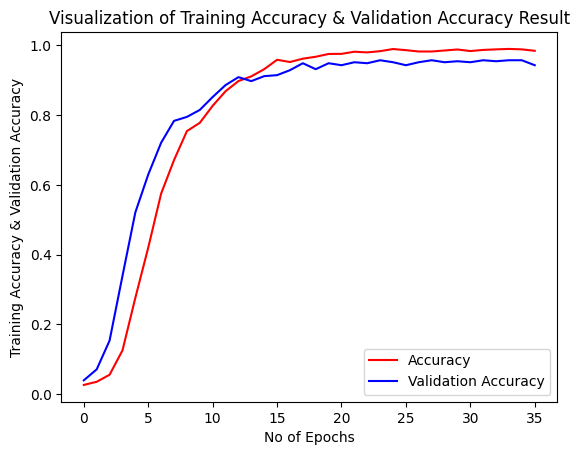
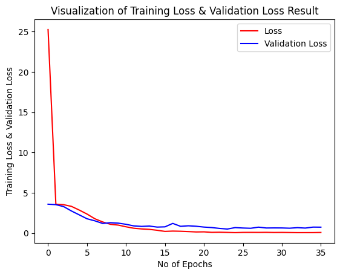
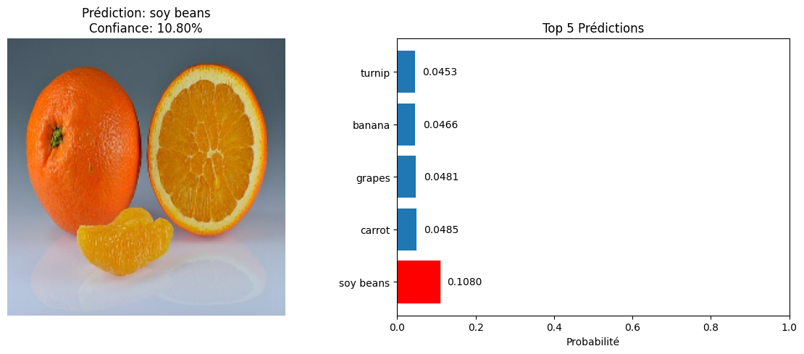
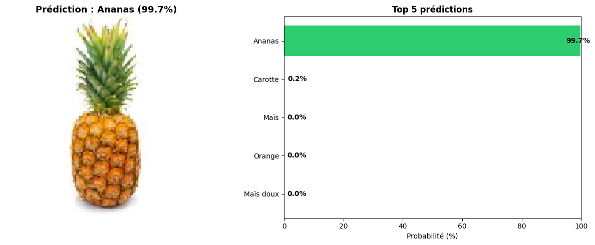
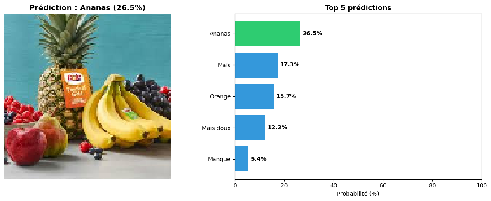
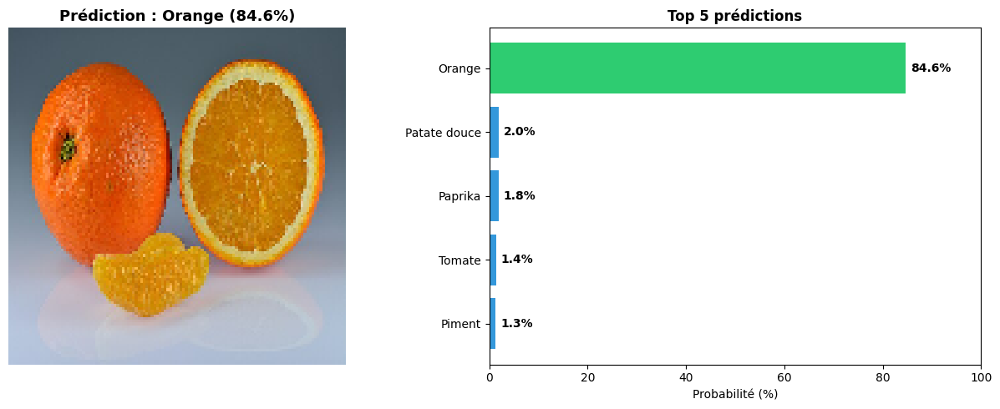
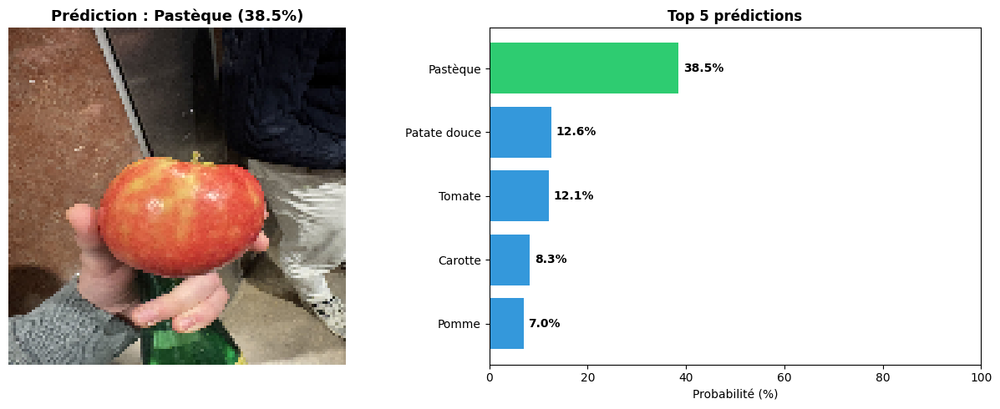

# CNN — Classification de Fruits et Légumes

**Auteur :** Nicolas Guilland
**Cours :** Deep Learning — M1 ESGI
**Date :** Mars 2026

---

## Contexte du projet

Ce projet s'inscrit dans une comparaison entre deux approches sur deux datasets différents :

- **Dataset de Lorenzo (Fruits-360)** : 90 000+ images sur fond blanc uniforme, 255 classes, conditions studio contrôlées.
- **Dataset de Nicolas (ce dépôt)** : ~3 000 images sur fond réel (supermarché, cuisine, jardin), 35 classes.

L'objectif de cette comparaison est d'explorer les **limites et points forts de chaque dataset** : le fond blanc simplifie la tâche de classification mais ne reflète pas des conditions réelles d'utilisation. Le dataset avec fond réel est plus difficile mais plus représentatif du monde réel.

---

## Dataset

| Propriété | Valeur |
|---|---|
| Source | Kaggle — Fruits and Vegetables Image Recognition Dataset |
| Classes | 35 fruits et légumes |
| Images totales | 3 024 |
| Taille des images | 128×128 px (RGB) |
| Type de fond | **Fond réel** (photos naturelles) |

**Classes :** pomme, banane, betterave, chou, poivron, carotte, chou-fleur, piment, maïs, concombre, aubergine, ail, gingembre, raisins, jalapeño, kiwi, citron, laitue, mangue, oignon, orange, paprika, poire, petits pois, ananas, grenade, pomme de terre, radis, soja, épinards, maïs doux, patate douce, tomate, navet, pastèque.

### Découpage des données

Le dataset Kaggle était initialement scindé en trois dossiers (`train/`, `validation/`, `test/`), mais nous avons découvert une **fuite de données** : les images de validation étaient déjà présentes dans le dossier `train/`. Entraîner le modèle avec ces splits aurait produit des métriques artificiellement gonflées (voir section [Tentatives ratées](#tentatives-ratées)).

Nous avons donc reconstruit les splits **manuellement depuis le dossier `train/`** avec une découpe stratifiée :

| Split | Images | Proportion |
|---|---|---|
| Train | 2 116 | 70% |
| Validation | 454 | 15% |
| Test | 454 | 15% |

Vérification d'absence de doublons entre les trois splits (`random_state=42`).

---

## Démarche suivie

### Étape 1 — Partir de l'existant

Nous sommes partis du modèle de classification chat/chien étudié en cours, qui donnait de bons résultats sur ce problème binaire. L'idée initiale était simple : adapter la dernière couche pour passer de 2 sorties (chat/chien) à 35 sorties (fruits/légumes).

**Résultat :** performances insuffisantes après 50 epochs — l'architecture était trop simple pour un problème 35 classes sur images réelles.

### Étape 2 — Tests d'architectures diverses

Plusieurs variantes ont été testées (blocs convolutifs avec RMSprop, Dropout différents, GlobalAveragePooling2D…). Deux symptômes récurrents sont apparus :

1. **val_accuracy bloquée très bas (~4–14%)** malgré une train_accuracy qui montait jusqu'à 88% → overfitting sévère.
2. **ReduceLROnPlateau trop agressif** (patience=2, min_lr=1e-4) : le learning rate atteignait son minimum au bout de 10 epochs, bloquant tout apprentissage ultérieur.

### Étape 3 — Faux bons résultats (fuite de données)

Après d'autres ajustements d'architecture, nous avons obtenu de très bonnes métriques en accuracy et val_accuracy avec l'architecture suivante :

```python
cnn = tf.keras.models.Sequential()
cnn.add(tf.keras.layers.Conv2D(filters=32, kernel_size=3, activation='relu', input_shape=[224, 224, 3]))
cnn.add(tf.keras.layers.Conv2D(filters=32, kernel_size=3, activation='relu'))
cnn.add(tf.keras.layers.MaxPool2D(pool_size=2, strides=2))
cnn.add(tf.keras.layers.Conv2D(filters=64, kernel_size=3, activation='relu'))
cnn.add(tf.keras.layers.Conv2D(filters=64, kernel_size=3, activation='relu'))
cnn.add(tf.keras.layers.MaxPool2D(pool_size=2, strides=2))
cnn.add(tf.keras.layers.Flatten())
cnn.add(tf.keras.layers.Dense(units=512, activation='relu'))
cnn.add(tf.keras.layers.Dense(units=512, activation='relu'))
cnn.add(tf.keras.layers.Dropout(0.2))
cnn.add(tf.keras.layers.Dense(units=35, activation='softmax'))
```

Les courbes semblaient très prometteuses sur ce modèle :


*Accuracy (train vs validation)*


*Loss (train vs validation)*

> Les deux courbes convergent vers ~99% d'accuracy et une loss proche de 0 en ~35 epochs — des résultats trop beaux pour être vrais.

Mais lors des tests sur de nouvelles images (photos personnelles hors dataset), les prédictions étaient catastrophiques :



> Une **orange** classée **soy beans à 15%** avec une distribution très plate — le modèle n'avait rien appris de généralisable.

En inspectant les données, nous avons compris : les images de validation du dataset Kaggle étaient déjà présentes dans le dossier `train/`. Le modèle se validait sur des images qu'il avait mémorisées pendant l'entraînement. Les ~99% de val_accuracy ne reflétaient donc aucune capacité de généralisation.

**Solution :** reconstruire les splits manuellement depuis `train/` uniquement, avec vérification d'absence de doublons.

### Étape 4 — Architecture finale

Après correction de la fuite de données, refonte complète de l'architecture (BatchNormalization dans chaque bloc conv, filtres asymétriques 128→128→64→128→32, tête Dense double) et ajustement des hyperparamètres (EarlyStopping avec patience=15, ReduceLROnPlateau avec patience=5) :

**Résultat final : 90.26% de précision sur le jeu de test.**

---

## Architecture du modèle

```
Input(128×128×3)
  │
  ├─ Conv2D(128, 3×3, same) → BatchNorm → ReLU → MaxPool(2×2)   [64×64×128]
  ├─ Conv2D(128, 3×3, same) → BatchNorm → ReLU → MaxPool(2×2)   [32×32×128]
  ├─ Conv2D(64,  3×3, same) → BatchNorm → ReLU → MaxPool(2×2)   [16×16×64]
  ├─ Conv2D(128, 3×3, same) → BatchNorm → ReLU → MaxPool(2×2)   [8×8×128]
  ├─ Conv2D(32,  3×3, same) → BatchNorm → ReLU → MaxPool(2×2)   [4×4×32]
  │
  ├─ Flatten                                                      [512]
  ├─ Dense(512) → BatchNorm → ReLU
  ├─ Dense(64)  → BatchNorm → ReLU
  ├─ Dropout(0.3)
  └─ Dense(35, softmax)
```

| Paramètre | Valeur |
|---|---|
| Paramètres totaux | 637 699 (~2.4 MB) |
| Paramètres entraînables | 635 587 |
| Framework | TensorFlow / Keras 2.21.0 |

---

## Entraînement

| Hyperparamètre | Valeur |
|---|---|
| Optimiseur | Adam |
| Learning rate initial | 1e-3 |
| Loss | categorical_crossentropy |
| Batch size | 32 |
| Epochs max | 100 |
| EarlyStopping | patience=15, monitor=val_accuracy |
| ReduceLROnPlateau | factor=0.5, patience=5, min_lr=1e-6 |

### Augmentation (train uniquement)

| Paramètre | Valeur |
|---|---|
| rotation_range | 25° |
| width/height_shift | 15% |
| shear_range | 15% |
| zoom_range | 20% |
| horizontal_flip | Oui |
| brightness_range | [0.8, 1.2] |

L'augmentation est plus forte que sur Fruits-360 (Lorenzo) pour compenser la variabilité naturelle des photos réelles (luminosité, angles, recadrage).

---

## Résultats

| Métrique | Valeur |
|---|---|
| **Val accuracy (best)** | **89.69%** (epoch 70) |
| **Test accuracy** | **90.26%** |
| Val loss (best) | 0.3786 |
| Test loss | 0.3576 |
| Epoch d'arrêt | 85 (EarlyStopping) |
| Meilleure epoch | 70 |

### Évolution du learning rate

| Epoch | LR |
|---|---|
| 1–19 | 1e-3 |
| 20–49 | 5e-4 |
| 50–61 | 2.5e-4 |
| 62–74 | 1.25e-4 |
| 75–79 | 6.25e-5 |
| 80–84 | 3.125e-5 |
| 85 | 1.56e-5 |

---

## Analyse des courbes d'entraînement

### Accuracy (train vs validation)

- **Epochs 1–8 :** démarrage lent, val_accuracy < 15%. Le modèle n'a pas encore extrait de features pertinentes.
- **Epochs 9–20 :** accélération brutale, val_accuracy passe de 36% à 63%. Le premier palier est atteint, ReduceLROnPlateau déclenche une première réduction du LR à l'epoch 20.
- **Epochs 21–56 :** progression irrégulière avec des oscillations importantes (val_accuracy entre 55% et 80%). La forte augmentation crée un bruit élevé dans les gradients — la train_accuracy par batch oscille entre 34% et 90%.
- **Epochs 57–70 :** convergence progressive vers le maximum, val_accuracy > 87% à partir de l'epoch 57, pic à **89.69% à l'epoch 70**.
- **Epochs 71–85 :** plateau — le modèle ne progresse plus, l'EarlyStopping déclenche à l'epoch 85.

> **Observation :** la train_accuracy affichée par epoch correspond à la moyenne glissante sur les batches, pas à une accuracy complète sur le train set. Les valeurs semblent basses (65–78% en fin d'entraînement) à cause de l'augmentation aléatoire qui rend chaque batch différent.

### Loss (train vs validation)

- La val_loss décroît de façon régulière de 3.5 (epoch 1) à 0.379 (epoch 70), avec les mêmes oscillations que l'accuracy aux epochs intermédiaires.
- La train_loss reste supérieure à la val_loss sur plusieurs epochs intermédiaires — comportement attendu avec une forte augmentation sur le set d'entraînement.
- Pas de signe d'overfitting classique (divergence train/val) : la BatchNormalization et le Dropout ont bien joué leur rôle.

### Test accuracy > Val accuracy

Le test accuracy (90.26%) dépasse légèrement le meilleur val_accuracy (89.69%). Ce résultat, contre-intuitif en apparence, est normal sur de petits datasets : la distribution du jeu de test peut être légèrement plus favorable. L'absence d'écart important confirme l'absence d'overfitting sur le split de validation.

### Exemples de prédictions

**Bonnes prédictions** — le modèle est très confiant sur des images non ambiguës :


*Ananas reconnu à 99.7% de confiance*


*Ananas reconnu à 26.5% de confiance parmi plusieurs fruits*


*Orange reconnue à 84.6% — confiance plus faible, mais correcte*

**Mauvaise prédiction** — les limites du modèle sur fond réel :


*Une tomate/pomme tenue en main classée **Pastèque à 38.5%** — le fond sombre et la forme ronde trompent le modèle. Signe que ~3 000 images ne suffisent pas pour tous les contextes de prise de vue.*

---

## Tentatives ratées

### 1. Architecture chat/chien adaptée
Modification de la dernière couche uniquement (2→35 sorties). Résultats insuffisants — l'architecture était trop peu profonde pour 35 classes sur fond réel.

### 2. Val_accuracy bloquée à ~4–14%
Architectures plus complexes avec RMSprop et `ReduceLROnPlateau(patience=2, min_lr=1e-4)`. Le LR atteignait son plancher en ~10 epochs, le gradient devenait négligeable et l'apprentissage s'arrêtait, malgré une train_accuracy qui continuait de monter jusqu'à 88%.

### 3. Fuite de données (data leakage)
Bons résultats en val_accuracy mais prédictions catastrophiques sur de nouvelles images. Cause : les images de validation Kaggle étaient déjà présentes dans `train/` — le modèle mémorisait les images d'un split à l'autre. Correction : redécoupage manuel stratifié avec vérification des doublons.

---

## Comparaison avec le dataset Fruits-360 (Lorenzo)

| | Nicolas | Lorenzo |
|---|---|---|
| Dataset | ~3 000 images, fond réel | ~90 000 images, fond blanc |
| Classes | 35 | 255 |
| Test accuracy | **90.26%** | 99.04% |
| Architecture | CNN Scratch (637K params) | CNN Scratch (4.87M params) |

L'écart de ~9 points d'accuracy s'explique principalement par la difficulté intrinsèque du dataset (fond réel, moins d'images) et non par l'architecture. Le modèle de Nicolas est susceptible de mieux généraliser sur des photos prises dans la vie quotidienne.

---

## Pistes d'amélioration

1. **Augmenter le dataset** : collecter davantage d'images par classe (actuellement ~86 images/classe en moyenne). C'est le facteur limitant principal.
2. **Transfer Learning** : un backbone pré-entraîné (EfficientNetB0, MobileNetV2) apporterait des features ImageNet déjà robustes aux fonds variés, compensant la petite taille du dataset.
3. **Fine-tuning en deux phases** : geler le backbone en phase 1, puis dégeler les dernières couches avec un LR très faible (1e-5) pour adapter les features hautes au domaine fruits/légumes.
4. **Meilleur équilibrage des classes** : certaines classes ont moins d'images que d'autres, un `class_weight` pourrait améliorer les performances sur les classes sous-représentées.
5. **Architecture adaptée aux petits datasets** : tester MobileNetV2 ou EfficientNetB0 (moins de paramètres, meilleures regularisations intégrées) plutôt qu'un CNN from scratch.

---

## Structure du dépôt

```
nicolas/
├── cnn_fruit_classification.ipynb          # Notebook principal (modèle final)
├── new_data_split_cnn_fruit_classification.ipynb  # Copie de travail identique
├── results.json                            # Résultats détaillés et métadonnées
├── README.md                               # Ce fichier
├── model/
│   ├── best_model.keras                    # Meilleur checkpoint (val_accuracy max)
│   ├── final_model.keras                   # Modèle sauvegardé en fin d'entraînement
│   └── architecture.png                    # Diagramme de l'architecture
├── plot/
│   ├── accuracy_courb-model_with_model_with_same_train&valid.png  # Accuracy ancien modèle (data leakage)
│   ├── loss-graph-model_with_model_with_same_train&valid.png.png  # Loss ancien modèle (data leakage)
│   ├── old_bad_result.png                  # Prédiction catastrophique ancien modèle
│   ├── bad-prediction.png                  # Exemple de mauvaise prédiction modèle final
│   ├── good-prediction.png                 # Exemple de bonne prédiction (ananas 99.7%)
│   └── good-prediction-2.png              # Exemple de bonne prédiction (orange 84.6%)
├── dataset/
│   ├── train/                              # Images d'entraînement (35 classes)
│   ├── validation/                         # Images de validation
│   └── test/                              # Images de test
└── bad/
    ├── detection-fruit.ipynb               # Anciennes tentatives (architectures V2/V3/V4)
    └── fruit-classification-cnn.ipynb      # Tentative initiale (vide)
```
